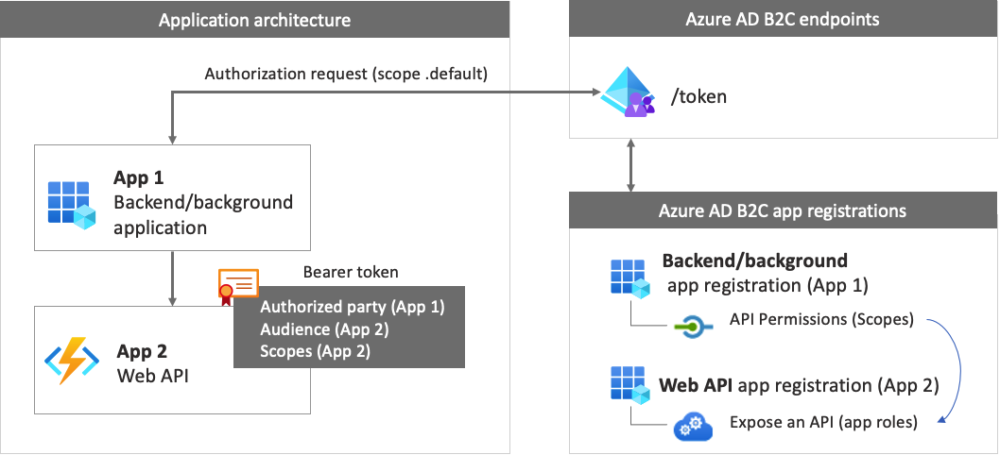

# Microsoft Graph Email Service

This workspace contains a Node.js email service that sends messages through Microsoft Graph API using the client-credentials flow.

## Architecture overview

The service uses:
- Node.js with the Azure Identity library to acquire an access token
- Microsoft Graph REST API to send email on behalf of a configured sender account
- Jest for unit testing

Architecture diagram:



## Prerequisites

- Node.js 18+ installed
- A Microsoft Entra application with application permissions for Microsoft Graph
- A sender mailbox configured in Microsoft 365 / Microsoft Graph
- A `.env` file in the service folder

## Setup

1. Change into the service directory:
   ```bash
   cd ms-graph-email-feature
   ```
2. Install dependencies:
   ```bash
   npm install
   ```
3. Create a `.env` file with the following values:
   ```env
   TENANT_ID=your-tenant-id
   CLIENT_ID=your-client-id
   CLIENT_SECRET=your-client-secret
   SENDER_EMAIL=your-sender@contoso.com
   ```

## Run the service

Send a test email:

```bash
node debug/test-run.js
```

## Debug helpers

The debugging scripts are stored in the debug folder:
- `node debug/debug-auth.js` checks whether the Microsoft Entra credentials are valid
- `node debug/inspect-token.js` inspects the granted roles in the access token
- `node debug/test-run.js` sends a real test email

## Test the project

Run the Jest test suite:

```bash
npm test
```

## CI workflow

The repository includes a GitHub Actions workflow in [.github/workflows/node-ci.yml](../ms-graph-email-feature/.github/workflows/node-ci.yml) that runs the unit tests on multiple Node.js versions.

## Commit workflow

```bash
git init
git add .
git status # verify .env is not listed
git commit -m "feat: implement email notification service using Microsoft Graph API"
git branch -M main
git remote add origin https://github.com/YOUR_USERNAME/YOUR_REPO_NAME.git
git push -u origin main
```

```bash
git add .github/workflows/node-ci.yml package.json
git commit -m "ci: add GitHub Actions workflow for automated Jest unit tests"
git push origin main
```
